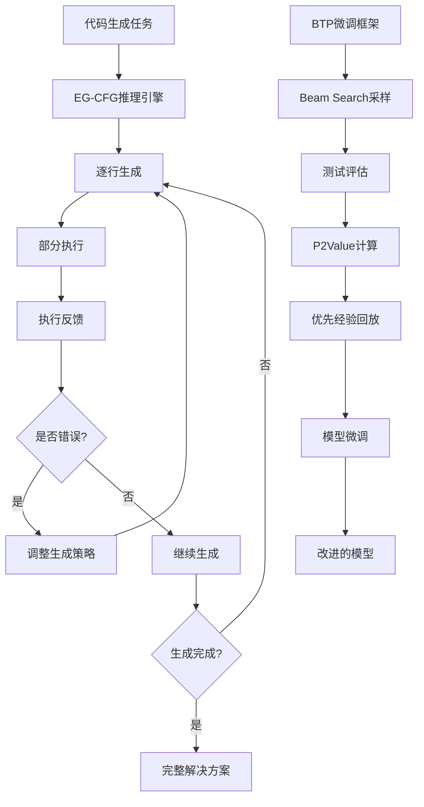

# EG-CFG: Execution-Guided Line-by-Line Code Generation 

**EG-CFG** is an inference-time algorithm for code generation that injects real-time execution feedback directly into the model's decoding loop. By incorporating dynamic runtime signals during generation, it steers the model toward solutions that are not only syntactically valid, but also functionally correct and executable.

**SOTA performance on top code generation benchmarks**: from foundational tasks (*MBPP*, *HumanEval*) to extended evaluations (*MBPP-ET*, *HumanEval-ET*) and challenging competitive programming problems (*CodeContests*) - all using open-source models only.

[](https://arxiv.org/abs/2506.10948)
[](https://youtu.be/YgBcDUQg7As?si=SYyKIyPTdKPNDmO4)
[](https://paperswithcode.com/paper/execution-guided-line-by-line-code-generation)

---

## 📖 论文核心思路与创新

### 核心问题
传统的代码生成方法通常采用"生成后测试"的模式，导致：
- 生成的代码可能存在语法错误或逻辑缺陷
- 无法在生成过程中利用执行反馈
- 需要大量后处理来筛选正确的解决方案

### 创新解决方案
EG-CFG提出了**执行引导的逐行生成**方法，核心创新包括：

1. **实时执行反馈**：在代码生成过程中，每生成几行代码就进行部分执行，获取运行时状态
2. **动态引导机制**：利用执行反馈调整后续生成的概率分布，避免错误路径
3. **BTP微调框架**：Beam Search + Testing + Prioritized Experience Replay的完整训练流程

### 技术路线图



---

## 🎯 实验规划与目标

我们的实验体系旨在验证EG-CFG方法的有效性，包括以下几个层面：

### 阶段1：基础验证实验
- **目标**：证明EG-CFG相比基线方法的性能提升
- **实验**：`step1_baseline_experiment.py`
- **指标**：Pass@k、成功率、代码质量

### 阶段2：BTP微调实验  
- **目标**：验证Beam Search + Testing + Prioritized Experience Replay的有效性
- **实验**：`step2_btp_experiment.py`、`step2_btp_finetune_experiment.py`
- **关键技术**：
  - P2Value计算：`P2Value = α × possibility + (1-α) × pass_rate`
  - 优先采样：Power Sampling和Rank Sampling两种策略
  - LoRA高效微调

### 阶段3：消融研究
- **目标**：分析不同组件的贡献度
- **实验**：`step3_ablation_study.py`
- **对比内容**：不同采样策略、P2Value权重、回放缓冲区大小

### 阶段4：超参数优化
- **目标**：找到最优的超参数配置
- **实验**：`step4_hyperparameter_study.py`
- **关键参数**：α（P2Value权重）、采样温度、beam大小

### 阶段5：大型模型验证
- **目标**：在更大规模模型上验证方法的通用性
- **实验**：`big_to_small_finetune_experiment.py`
- **策略**：大模型采样 → 小模型微调

---

## 🏗️ 项目架构

```
eg_cfg-master/
├── eg_cfg/                     # 核心算法实现
│   ├── eg_cfg.py              # EG-CFG主算法
│   ├── execution_manager.py   # 执行引擎
│   ├── model_utils.py         # 模型工具
│   └── mbpp_utils.py          # 数据集工具
├── experiments/               # 实验套件
│   ├── step1_baseline_experiment.py      # 基线实验
│   ├── step2_btp_experiment.py          # BTP实验
│   ├── step2_btp_finetune_experiment.py # BTP微调实验
│   ├── step3_ablation_study.py          # 消融研究
│   ├── step4_hyperparameter_study.py    # 超参数研究
│   ├── big_to_small_finetune_experiment.py # 大小模型实验
│   ├── btp_finetune_framework.py        # BTP框架核心
│   ├── run_all_experiments.py           # 主运行脚本
│   └── run_*.py                         # 各种快速启动脚本
├── configs/                   # 配置文件
│   ├── session_config.*.json # 会话配置
│   └── dynamic_signals_params.json # 动态信号参数
├── data/                      # 数据集和结果
├── scripts/                   # 服务器运行脚本
└── traces_dumper/            # 执行轨迹工具
```

---

## 🚀 快速开始

### 环境配置
```bash
git clone --recurse-submodules git@github.com/OUR_REPO/eg_cfg.git
cd eg_cfg
conda env create -f environment.yml -n eg-cfg-env
conda activate eg-cfg-env
python scripts/redirect_env_to_submodules.py $PWD/submodules/
```

### 运行基础实验
```bash
# 运行完整实验套件
python experiments/run_all_experiments.py --model_name "deepseek-ai/deepseek-coder-1.3b-instruct"

# 快速测试
python experiments/run_all_experiments.py --model_name "deepseek-ai/deepseek-coder-1.3b-instruct" --mode quick

# 单个实验
python experiments/run_all_experiments.py --model_name "deepseek-ai/deepseek-coder-1.3b-instruct" --mode single --single_step btp
```

### 运行BTP微调实验
```bash
# 基础BTP微调
python experiments/run_btp_finetune_experiment.py \
  --source-model deepseek-ai/deepseek-coder-1.3b-instruct \
  --sampling-method power \
  --sampling-alpha 1.0 \
  --max-problems 50

# 大小模型配合微调
python experiments/big_to_small_finetune_experiment.py \
  --source-model deepseek-ai/DeepSeek-Coder-V2-Lite-Instruct \
  --target-model deepseek-ai/deepseek-coder-1.3b-instruct \
  --max-problems 100
```

---

## 🔧 核心技术组件

### EG-CFG推理引擎
- **文件**：`eg_cfg/eg_cfg.py`
- **功能**：逐行生成 + 实时执行反馈
- **关键参数**：
  - `temperature`: 采样温度
  - `num_candidates`: 候选数量
  - `completion_horizon`: 完成视野

### BTP微调框架
- **文件**：`experiments/btp_finetune_framework.py`
- **核心类**：
  - `P2ValueCalculator`: P2Value计算
  - `PrioritizedSampler`: 优先采样器
  - `ExperienceBuffer`: 经验回放缓冲区
- **采样策略**：
  - Power Sampling: `P(i) = pi^α / Σ pk^α`
  - Rank Sampling: `pi = 1/rank(i)`

### 模型管理器
- **支持模型类型**：
  - 本地模型：DeepSeek、SmolLM、CodeLlama
  - 云端API：OpenAI GPT、DeepSeek API
- **微调技术**：LoRA高效微调
- **部署方式**：本地推理、推理端点

---

## 📊 实验结果

### MBPP和MBPP-ET基准测试

| Model               | Method            | MBPP (%) | MBPP-ET (%) | RSR (MBPP) | RSR (MBPP-ET) |
| ------------------- | ----------------- | -------- | ----------- | ---------- | ------------- |
| DeepSeek-Coder 1.3B | Baseline LLM      | 49.4     | 42.6        | 0.0        | 0.0           |
| DeepSeek-Coder 1.3B | EG-CFG (Ours)     | 83.2     | 59.8        | 66.79      | 29.96         |
| DeepSeek-V3-0324    | Baseline LLM      | 82.8     | 64.8        | 0.0        | 0.0           |
| DeepSeek-V3-0324    | **EG-CFG (Ours)** | **96.6** | **73.0**    | **80.23**  | **23.30**     |

### HumanEval和HumanEval-ET基准测试

| Model            | Method            | HumanEval (%) | HumanEval-ET (%) | RSR (HE)  | RSR (HE-ET) |
| ---------------- | ----------------- | ------------- | ---------------- | --------- | ----------- |
| DeepSeek-V3-0324 | Baseline LLM      | 82.92         | 79.20            | 0.0       | 0.0         |
| DeepSeek-V3-0324 | **EG-CFG (Ours)** | **96.95**     | **87.19**        | **78.54** | **38.56**   |

---

## 🎛️ 命令行参数说明

### 通用参数
- `--model-name`: 模型名称或路径
- `--dataset`: 数据集选择（mbpp/humaneval）
- `--output-dir`: 结果输出目录
- `--seed`: 随机种子

### BTP特定参数
- `--sampling-method`: 采样方法（power/rank）
- `--sampling-alpha`: 采样α参数
- `--p2value-alpha`: P2Value权重α
- `--num-beams`: Beam Search大小
- `--batch-size`: 训练批大小

### LoRA微调参数
- `--lora-r`: LoRA rank
- `--lora-alpha`: LoRA alpha
- `--lora-dropout`: LoRA dropout率

---

## 🔬 研究方向与扩展

### 当前研究重点
1. **多语言代码生成**：扩展到Java、C++、JavaScript等
2. **长序列代码生成**：处理更复杂的编程任务
3. **交互式代码调试**：结合执行反馈进行自动调试

### 未来扩展计划
1. **强化学习集成**：将执行反馈作为奖励信号
2. **多模态代码生成**：结合自然语言描述和示例代码
3. **分布式训练**：支持大规模模型的分布式微调

---

## 📚 相关资源

- **论文**：[Execution-Guided Line-by-Line Code Generation](https://arxiv.org/abs/2506.10948)
- **视频介绍**：[YouTube演示](https://youtu.be/YgBcDUQg7As?si=SYyKIyPTdKPNDmO4)
- **Papers with Code**：[项目页面](https://paperswithcode.com/paper/execution-guided-line-by-line-code-generation)

---

## 🤝 贡献指南

1. Fork本项目
2. 创建特性分支：`git checkout -b feature/amazing-feature`
3. 提交更改：`git commit -m 'Add some amazing feature'`
4. 推送分支：`git push origin feature/amazing-feature`
5. 提交Pull Request

---

## 📄 许可证

本项目采用 [LICENSE](LICENSE) 许可证。

---

## 📧 联系方式

如有问题或建议，请通过以下方式联系：
- 创建Issue
- 发送邮件至项目维护者

**EG-CFG项目致力于推进代码生成领域的研究，欢迎研究者和开发者参与贡献！**
